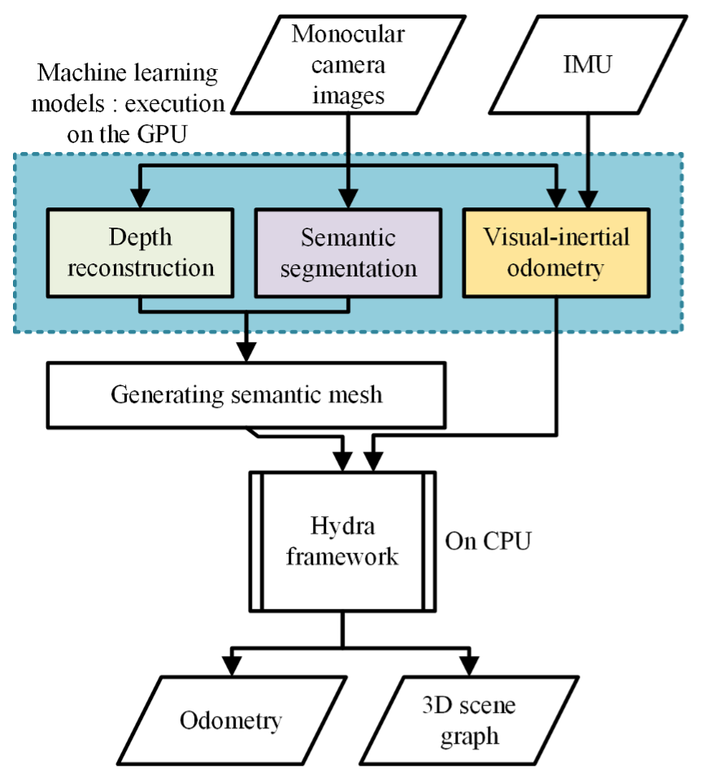

# Mono_Hydra
[Poster](<doc/media/PSB Poster A3 gen.pdf>)
## Mono-Hydra flow chart


## Installing Mono_Hydra
### Install Instructions 
TODO + a docker file

## How to run Mono Hydra with ITC building dataset

### Download data 
TODO

### ROS commands, Each in new terminal
```
roslaunch mono_hydra real_cam_hydra.launch start_visualizer:=true
```
** HRNetV2 trained on ADE20k **
```
roslaunch semantic_segmentation_ros semantic_segmentation.launch
```

** RIVO2 based odometry prediction node **
```
roslaunch rvio2 realsense.launch
```

** DistDepth model based depth prediction **
```
roslaunch depth_distdepth dist_depth.launch
```

** or Lite-Mono based depth prediction**
```
roslaunch depth_lite_mono lite_mono.launch
```

** Play the downloaded ROS bag file **
```
rosbag play office_3.bag --clock --pause /camera/color/image_raw:=/cam0/image_raw  /camera/imu:=/imu0 /tf:=/tf_ignore /tf_static:=/tf_static_ignore -r 0.1
```


## Results

Depth prediction network	2nd floor	    3rd floor  
	                        ME (m)	SD (m)	ME (m)	SD (m)
DistDepth	                0.1979	0.1810	0.2128	0.1645
Lite-Mono	                0.3818	0.2692	0.3617	0.2468
